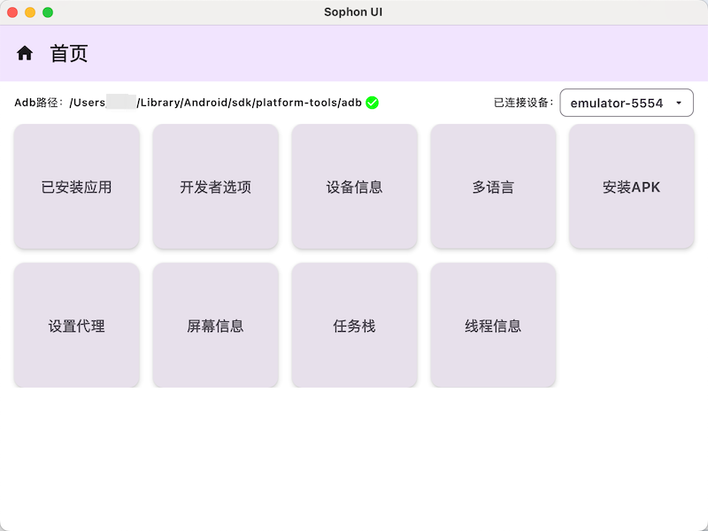

# Sophon UI

Sophon UI是一款功能强大的Android开发辅助工具，提供一系列实用功能，帮助开发者更高效地进行Android应用开发和测试。

## 主要功能

- **设备管理**：连接和管理多个Android设备
- **APK安装**：快速安装APK文件到连接的设备
- **应用管理**：查看和管理设备上已安装的应用
- **线程监控**：监控应用线程状态
- **屏幕操作**：查看或修改屏幕参数
- **代理设置**：配置网络代理
- **国际化支持**：多语言界面
- **开发者工具**：一系列开发调试工具
- **任务栈**：Activity任务栈

## 界面预览



## 系统要求

- JDK 17或更高版本
- ADB工具（如未安装，应用会提示添加）
- 支持Windows、macOS和Linux

## 快速开始

1. 下载并安装Sophon UI
2. 启动应用
3. 如果是首次使用，系统会提示添加ADB可执行文件
4. 连接Android设备
5. 从主界面选择所需功能

## 构建项目

```bash
./gradlew build
```

## 运行应用

```bash
./gradlew run
```

## 打包应用

```bash
./gradlew packageDmg      # macOS
./gradlew packageMsi      # Windows
./gradlew packageDeb      # Linux
```

## 技术栈

- Kotlin
- Jetpack Compose for Desktop
- Voyager导航库
- Protobuf数据序列化
- Datastore数据存储

## 贡献指南

欢迎提交问题报告和功能请求。如果您想贡献代码，请fork本仓库并提交PR。

## 许可证

[MIT License](LICENSE)
